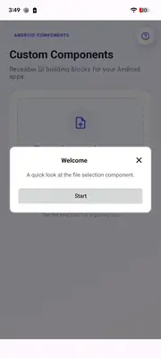
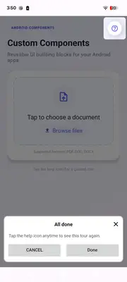
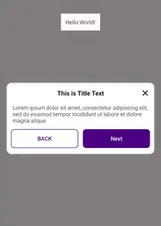

[](https://jitpack.io/#mandeep1999/WalkMeThrough)

# WalkMeThrough

**WalkMeThrough** is an Android library that guides users through your app by highlighting specific views and showing instructional UI.

## Add dependency

Add JitPack to your `settings.gradle` if needed:

```gradle
dependencyResolutionManagement {
    repositories {
        google()
        mavenCentral()
        maven { url 'https://jitpack.io' }
    }
}
```

```gradle
dependencies {
    implementation 'com.github.mandeep1999:WalkMeThrough:2.0.2'
}
```

**Requirements:** Android API 24+ (Android 7.0), Kotlin.

## Quick start

```kotlin
import `in`.mandeep_singh.walkmethrough.Placement
import `in`.mandeep_singh.walkmethrough.Walkthrough

Walkthrough.with(this)
    .card(findViewById(R.id.profile_icon)) {
        title = "Profile"
        description = "Open your profile from here."
        nextText = "Next"
        placement = Placement.CENTER
    }
    .card(findViewById(R.id.settings_icon)) {
        title = "Settings"
        description = "Adjust preferences anytime."
        backText = "Back"
        nextText = "Done"
    }
    .doOnStepShown { index -> /* analytics */ }
    .doOnComplete { /* tour finished */ }
    .show()
```

The overlay attaches to the activity content root automatically. Override with `overlayParent(viewGroup)` if needed.

## Tooltip steps

```kotlin
Walkthrough.with(this)
    .tooltip(findViewById(R.id.search_icon)) {
        title = "Search"
        description = "Find anything in the app."
        placement = Placement.BOTTOM
    }
    .doOnComplete { /* finished */ }
    .show()
```

Tooltip defaults: no dimmed background, no target cutout, tap outside advances.

## Mixed presentations

```kotlin
Walkthrough.with(this)
    .fullScreen(contentRoot) {
        title = "Welcome"
        description = "A quick tour of the app."
        nextText = "Start"
    }
    .spotlight(featureView)
    .tooltip(searchView) { title = "Quick search tip"; placement = Placement.BOTTOM }
    .card(settingsView) { title = "Settings"; nextText = "Done" }
    .banner(cartView) { title = "Cart"; nextText = "Next" }
    .show()
```

## Spotlight, banner, and full-screen

```kotlin
Walkthrough.with(this)
    .spotlight(findViewById(R.id.feature_button))
    .banner(findViewById(R.id.cart_icon)) {
        title = "Your cart"
        description = "Review items before checkout."
        nextText = "Continue"
    }
    .fullScreen(findViewById(android.R.id.content)) {
        title = "Welcome"
        description = "Let's walk through the basics."
        nextText = "Get started"
    }
    .show()
```

## Custom UI

Use `guideContent(...)` with `GuideContent` to replace default UI for any presentation. Return `null` for spotlight-only steps.

```kotlin
Walkthrough.with(this)
    .guideContent(myGuideContent)
    .card(target) { title = "Hello" }
    .show()
```

## API overview

| Method / type | Purpose |
|---------------|---------|
| `Walkthrough.with(activity)` | Entry point — returns [WalkthroughBuilder] |
| `card(target) { ... }` | Instructional card with optional back/next |
| `tooltip(target) { ... }` | Compact anchored tooltip |
| `spotlight(target) { ... }` | Spotlight cutout only |
| `banner(target) { ... }` | Bottom banner |
| `fullScreen(target) { ... }` | Full-screen centered card |
| `add(GuideStep)` | Add a pre-built step |
| `overlayParent(viewGroup)` | Custom overlay attachment point |
| `guideContent(GuideContent)` | Custom UI provider |
| `setListener(WalkthroughListener)` | Java-friendly lifecycle callbacks |
| `doOnStepShown`, `doOnComplete`, `doOnDismiss`, `doOnOutsideClick` | Kotlin callback helpers |
| `show()` | Returns [WalkthroughController] |

### Step builder properties

| Property | Purpose |
|----------|---------|
| `title`, `description` | Copy |
| `backText`, `nextText` | Navigation button labels |
| `titleColor`, `descriptionColor` | Text colors |
| `backTextColor`, `nextTextColor` | Button label colors |
| `background`, `backgroundColor` | Content panel background |
| `backBackground`, `nextBackground` | Button backgrounds |
| `padding` | Inner padding (`Padding` in dp) |
| `placement` | `Placement.TOP`, `CENTER`, or `BOTTOM` |
| `dimBackground`, `highlightTarget` | Overlay behavior |
| `advanceOnOutsideTap` | Tap outside advances step |
| `showArrow` | Tooltip pointer arrow (tooltip only) |

### GuidePresentation defaults

| Presentation | Dim background | Highlight target | Tap outside advances |
|--------------|----------------|------------------|------------------------|
| `CARD` | yes | yes | no |
| `TOOLTIP` | no | no | yes |
| `SPOTLIGHT` | yes | yes | yes |
| `BANNER` | yes | yes | no |
| `FULL_SCREEN` | yes | no | no |

## Screenshots

<p align="center">
  
  
  
</p>

## License

MIT — see [LICENSE](LICENSE).
